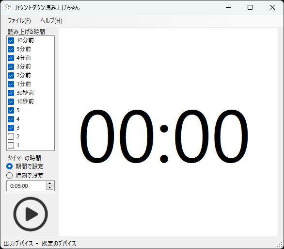

# VoiceCountdown

1. ソフトウェアを起動すると下の画像のようなウィンドウが表示されます。

    

2. 読み上げる時間を選択します。
3. 開始時間を「h:mm:ss」で設定します。初期値は5分です。
4. 出力デバイスを選択します。
5. 「▶」を押すとカウントダウンが開始します。
6. 指定した読み上げ時間になったら音声が再生されます。
    あみたろの声素材工房(<https://amitaro.net/>)の音声を使用しました
7. 「■」を押すとカウントダウンが停止します。
